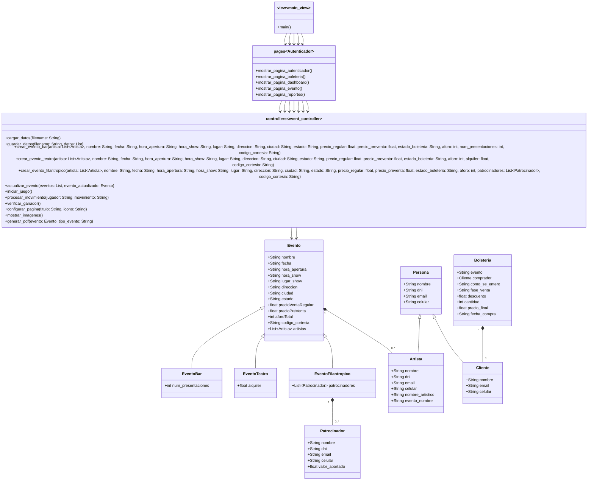

# Proyecto Segunda parte
## Instalacion
Instalar el proyecto en su computador local. Escriba desde la línea de comandos y ubicado en la carpeta raíz del proyecto pip install -r requirements.txt.
Ejecutar el juego localmente. Escriba en consola streamlit run  Su navegador debería abrir el juego

# Diagrama de Clases

