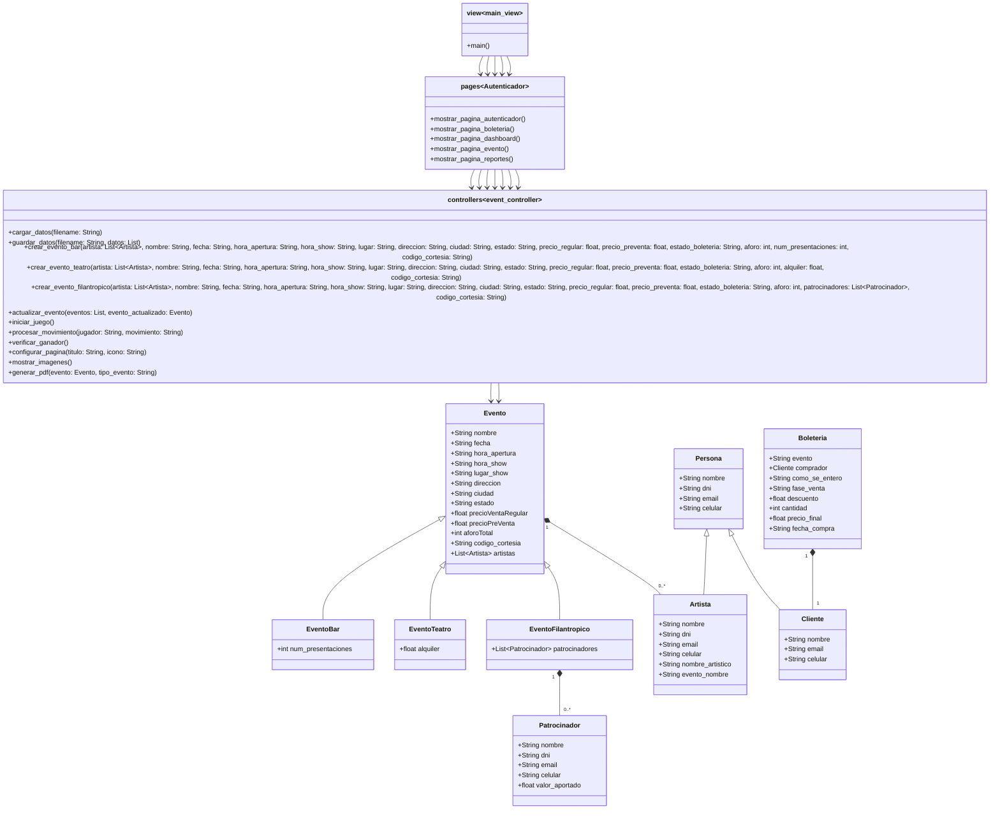
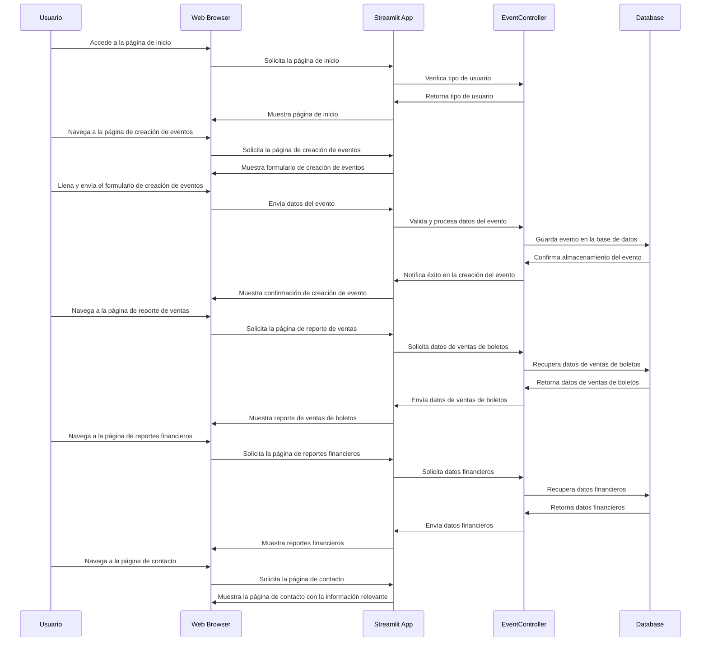

# Manual de Instrucciones para Phoenix Eventos
## Instalacion

Instalar el proyecto en su computador local. Escriba desde la línea de comandos y ubicado en la carpeta raíz del proyecto pip install -r requirements.txt.
Ejecutar el juego localmente. Escriba en consola "python run.py" esto ejecutara streamlit y en breve observara la pagina 

# Diagrama de Clases

# Guia de usuario 
contraseña para cambio a administrador: admin123
## Página de Inicio
**Descripción:** 
La página principal de Phoenix Eventos, donde se puede cambiar el tipo de usuario entre "Usuario" y "Administrador".
**Uso:** 
Seleccione el tipo de usuario o registre su ingreso a un evento.

## Página de Eventos (administrador)
**Descripción:** 
Aquí puede crear, modificar y eliminar eventos.
**Uso:**
Para crear un evento, seleccione el tipo de evento y complete los campos requeridos.
Para modificar un evento, seleccione el evento existente y realice los cambios necesarios.
Si un evento ya tiene boletos vendidos, no podrá eliminarlo ni modificar su estado a "realizado".

## Página de Boletería
**Descripción:** 
Permite la compra de boletos para los eventos disponibles.
**Uso:**
Seleccione un evento y complete la información del comprador.
Aplique descuentos y códigos de cortesía si es necesario.
Finalice la compra y descargue el recibo en formato PDF.

## Página de Dashboard
**Descripción:** 
Proporciona una vista general de los eventos y sus métricas.
**Uso:**
Filtre los eventos por rango de fechas.
Visualice las gráficas de cantidad de eventos por tipo y los ingresos totales por eventos.
Revise los ingresos totales para la casa y los artistas.

## Página de Reportes
**Descripción:** 
Genera reportes detallados de ventas, financieros y datos de los compradores y artistas.
**Uso:**
Revise la cantidad de boletos vendidos por tipo y los ingresos totales por preventa y venta regular.
Desglose los ingresos por tipo de pago y boletería.
Visualice los datos de los compradores con gráficos y descargue el informe en formato Excel.
Filtre por artista para ver los datos de sus eventos y descargue el reporte correspondiente.

## Página de Nosotros
**Descripción:** 
Información sobre Phoenix Eventos.
**Uso:** 
Lea sobre nuestra misión, visión y el equipo que hace posible Phoenix Eventos.

## Página de Contacto
**Descripción:** 
Información de contacto y redes sociales de Phoenix Eventos.
**Uso:**
Encuentre nuestro número de teléfono, dirección de correo electrónico y ubicación física.
Síganos en nuestras redes sociales: Instagram, Facebook y Twitter.
Complete el formulario de contacto para comunicarse con nosotros.

# Diagrama de secuencias
La intencion de este diagrama esque el usuario pueda ver como es un flujo tipico en nuestra aplicacion.

# Cumplimiento de los requerimientos tecnicos

## Eventos
1. Se deben manejar 3 tipos de eventos en el sistema: evento en Bar, evento en Teatro y evento Filantrópico (boletería sin costo).

2. El sistema permite ingresar detalles del evento como artista o artistas del show, nombre, fecha, hora de apertura de puertas, hora del show, lugar, dirección y ciudad.

3. El sistema permite definir el estado del evento (realizado, por realizar, cancelado, aplazado, cerrado). Cambios en el estado "realizado" están restringidos.

4. El administrador puede definir precios de boletas para diferentes categorías y fases de venta (preventa y venta regular).

5. Se impide la eliminación de eventos con boletería vendida.

6. El sistema permite definir el aforo total del evento.

7. Ingreso al evento

## Boleteria

1. Se requieren datos del comprador y cómo se enteró del evento al vender una boleta.
2. El sistema verifica la disponibilidad de aforo antes de completar la venta.
3. El precio de la boleta varía según la fase de venta y aplicaciones de descuentos.
4. Las boletas de cortesía se pueden emitir con un precio de cero.
5. Generación de PDF con la boleta.

## Reportes

1. Reporte de Ventas de Boletas: Detalla cantidad de boletas vendidas por tipo (incluyendo cortesías) y los ingresos totales por preventa y venta regular.
2. Reporte Financiero: Desglosa los ingresos por tipo de pago y tipo de boletería.
3. Reporte de Datos de los Compradores: Ofrece información detallada de los compradores permitiendo análisis demográficos y de comportamiento para estrategias de marketing. Debe incluir al menos dos gráficas visualizando esta información (en Plotly) y estar disponible para descargar en formato Excel.
4. Reporte de Datos por Artista: Dado un artista (que se puede filtrar desde la interfaz gráfica) será posible reportar datos generales de sus eventos gestionados en el sistema. En los datos generales de cada evento deben estar cosas como (nombre del evento, fecha, lugar, cantidad de boletas vendidas, porcentaje de aforo cubierto).

## Dashboard

1. Dashboard con su rango de fechas.
2. Graficos